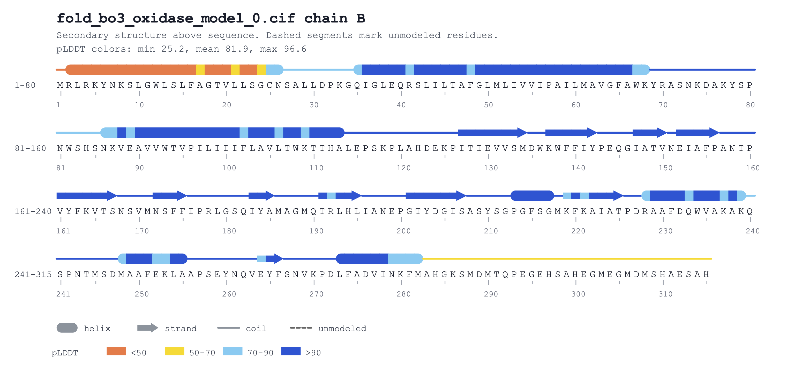
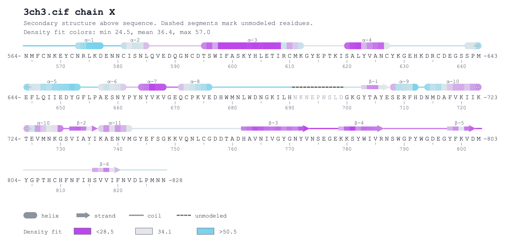

# Protein Sequence Annotator

`protein_seq_annotator.py` renders a compact per-chain sequence annotation figure from a `PDB` or `mmCIF` file.

The output includes:
- secondary-structure annotations above the sequence
- dashed lines for unmodeled regions
- residue numbering ticks
- confidence/B-factor coloring
- vector output as `PDF` by default, with `SVG` kept as an option/fallback

## Caveat
Written with the assistence of Codex/ChatGPT5.4; Tested against a few different structures, but there may still be bugs.

## Requirements

- Python 3.9+
- `gemmi`
- `mkdssp`

(Both gemmi & mkdssp are included with CCP4, so if CCP4 is installed they should be available)

Optional:
- `rsvg-convert` or `cairosvg` for PDF export

If PDF export is unavailable, the script falls back to SVG.

## Basic Usage

Generate one output per polymer chain:

```bash
python3 protein_seq_annotator.py model.cif
python3 protein_seq_annotator.py model.pdb
```

Keep the intermediate SVG as well as the PDF:

```bash
python3 protein_seq_annotator.py model.cif --svg
```

Select a chain explicitly:

```bash
python3 protein_seq_annotator.py model.cif --chain A
python3 protein_seq_annotator.py model.cif --chain A,B
```

Write outputs to another directory:

```bash
python3 protein_seq_annotator.py model.cif -o out
```

## Coloring Modes

Default behavior:
- if non-zero B-factors are present, they are treated as `pLDDT`
- AlphaFold colors are used: `<50`, `50-70`, `70-90`, `>90`

Raw B-factor mode:

```bash
python3 protein_seq_ann1Gotator.py model.pdb --bfac
```

In `--bfac` mode:
- colors use a blue -> light gray -> red scale
- scaling is percentile-based
- the legend shows actual B-factor values for the low, middle, and high anchors

## Other Flags

```
--wrap N      Residues per line, default 80
--prefix STR  Output filename prefix
--svg         Keep SVG when PDF export succeeds
--bfac        Color by B-factor instead of pLDDT
--label       Add labels to strands and helices
--paginate    Make a multi page PDF (only works on MacOS currently)
```

## Notes

- `mkdssp` is required because the script uses it to derive or supplement secondary-structure assignments.
- Very short secondary-structure fragments are suppressed:
  - helices shorter than 4 residues are shown as coil
  - strands shorter than 3 residues are shown as coil

## Example Output

**pLDDT coloring:**


**B-factor coloring:**

